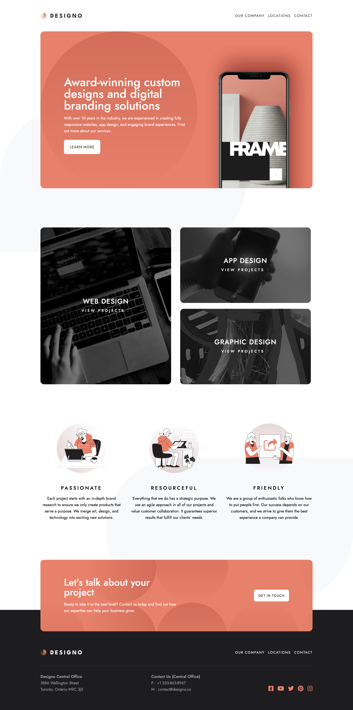

# Frontend Mentor - Designo agency website solution

This is a solution to the [Designo agency website challenge on Frontend Mentor](https://www.frontendmentor.io/challenges/designo-multipage-website-G48K6rfUT). Frontend Mentor challenges help you improve your coding skills by building realistic projects. 

## Table of contents

- [Overview](#overview)
  - [The challenge](#the-challenge)
  - [Screenshot](#screenshot)
  - [Links](#links)
- [My process](#my-process)
  - [Built with](#built-with)
  - [What I learned](#what-i-learned)
  - [Continued development](#continued-development)
- [Author](#author)

## Overview

### The challenge

Users should be able to:

- View the optimal layout for each page depending on their device's screen size
- See hover states for all interactive elements throughout the site
- Receive an error message when the contact form is submitted if:
  - The `Name`, `Email Address` or `Your Message` fields are empty should show "Can't be empty"
  - The `Email Address` is not formatted correctly should show "Please use a valid email address"
- **Bonus**: View actual locations on the locations page maps (we recommend [Leaflet JS](https://leafletjs.com/) for this)


### Screenshot



### Links

- Solution URL: [Github](https://github.com/ringtho/designo)
- Live Site URL: [Netlify](https://stunning-bienenstitch-667bb4.netlify.app/)

## My process

### Built with

- Semantic HTML5 markup
- CSS custom properties
- Flexbox
- Mobile-first workflow
- [React](https://reactjs.org/) - JS library
- React router dom
- Leaflet JS


### What I learned

I learnt alot about CSS layout positioning that is absolute, relative and sticky positioning. I didn't use fixed positioning for the navbar as it was putting my elements out of flow. The sticky positioning was apt for this case.
I made use of react router dom for navigation purposes. I also has a great time learning about react-router-hash-link to navigate to a certain point on a page described by an id


```react

<HashLink className="hero-btn link-btn" to="#offers">
                        LEARN MORE</HashLink>
```


### Continued development

I need to focus on learning typescript and including it in my projects for better type casting. I also need to learn more css frameworks.

## Author

- Frontend Mentor - [@ringtho](https://www.frontendmentor.io/profile/ringtho)
- Twitter - [@smithringtho](https://www.twitter.com/smithringtho)


